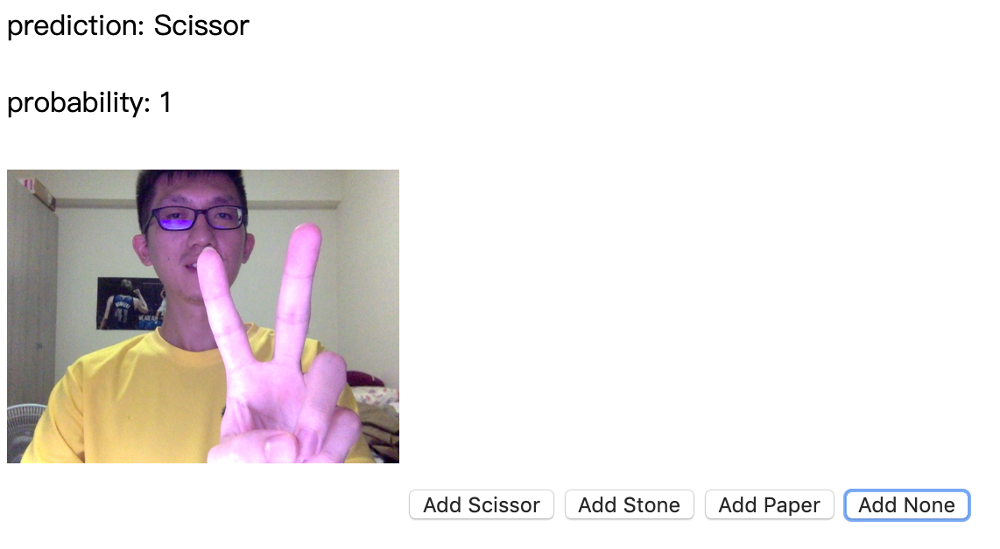
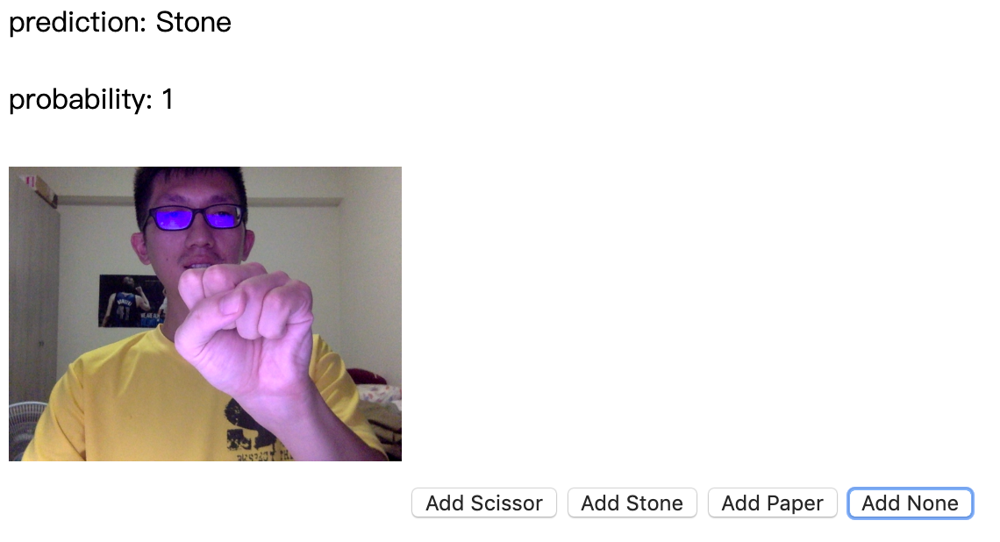
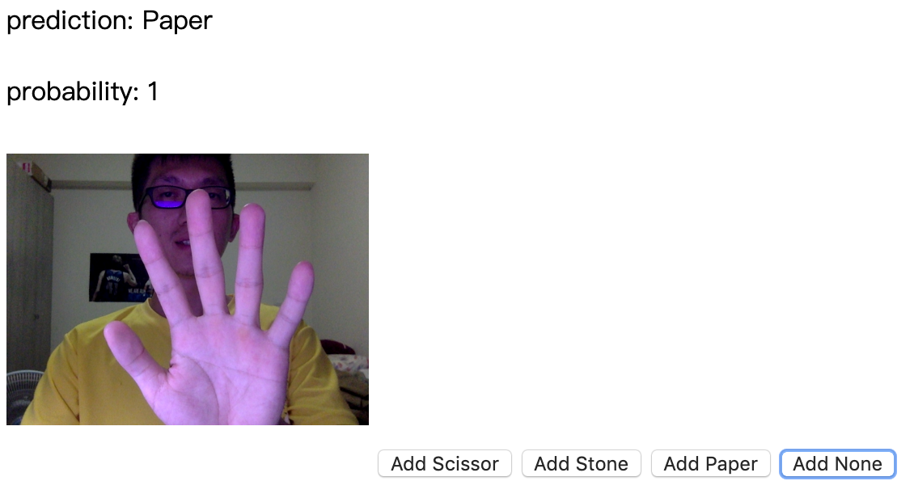
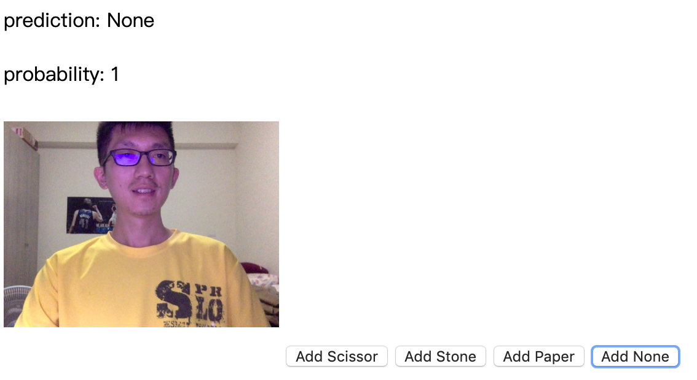

# Image classifer using TensorFlow.js

This project follows the [toturial](https://www.tensorflow.org/js/tutorials/transfer/image_classification) of TensorFlow.js to build a web app.

You can find detailed steps in the [codelabs](https://codelabs.developers.google.com/codelabs/tensorflowjs-teachablemachine-codelab/index.html#0).

The models using here are the pre-trained [MobileNet](https://arxiv.org/abs/1704.04861) and [K-Nearest Neighbors](https://en.wikipedia.org/wiki/K-nearest_neighbors_algorithm) (KNN).

The basic ideas of this project are taking the frames/images from the webcam, then using the MobileNet model to predict the items of those images. In order to narrow down the classes of the prediction, we give certain number of classes input and save each class some examples by clicking the corresponding buttons. Therefore, we can apply KNN to further classify the frames/images to the classes given by us.

In this project, I set 4 classes which are Scissor, Stone, Paper, and None, respectively. You can play with it by following steps:

1. Open index.html in your browser.
2. Allow the access of your webcam. (You'll need to wait a few seconds before the message pop out since it needs some time to load pre-trained MobileNet)
3. Take frames/images of corresponding classes(Scissor, Stone, Paper, and None) by clicking the buttons. (10 images per class is quite enough)
4. Check the predicion result on top of your webpage.

Enjoy~!  
