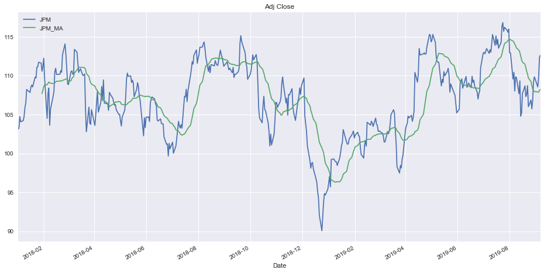
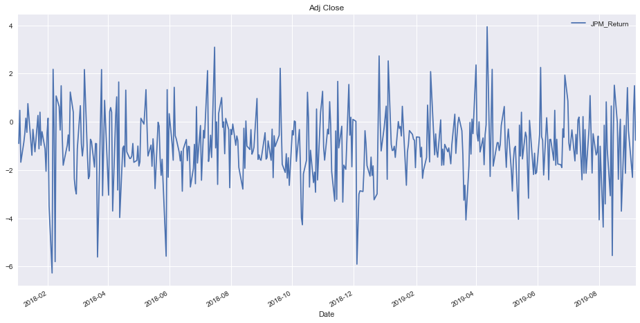
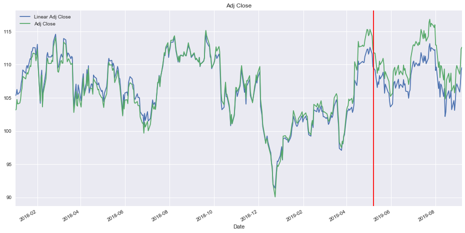
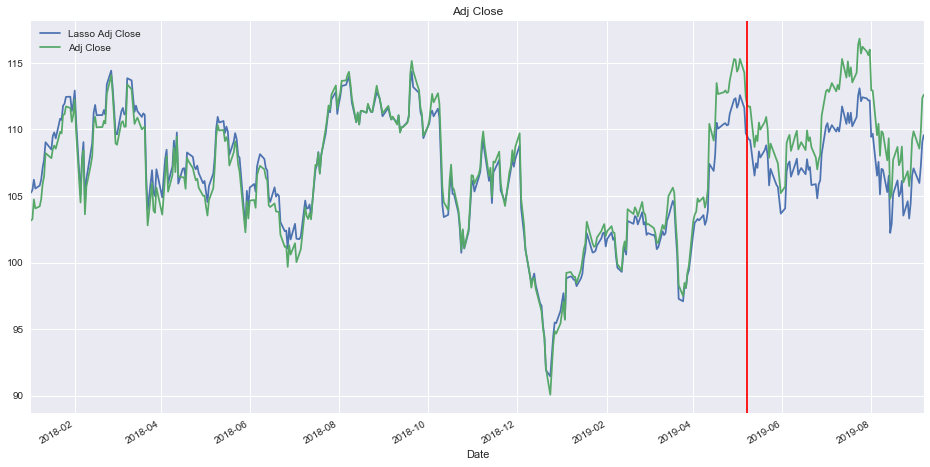
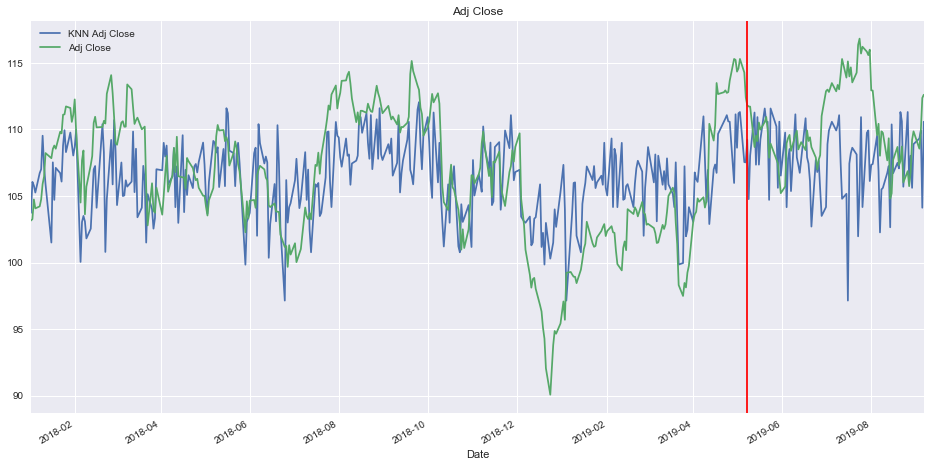
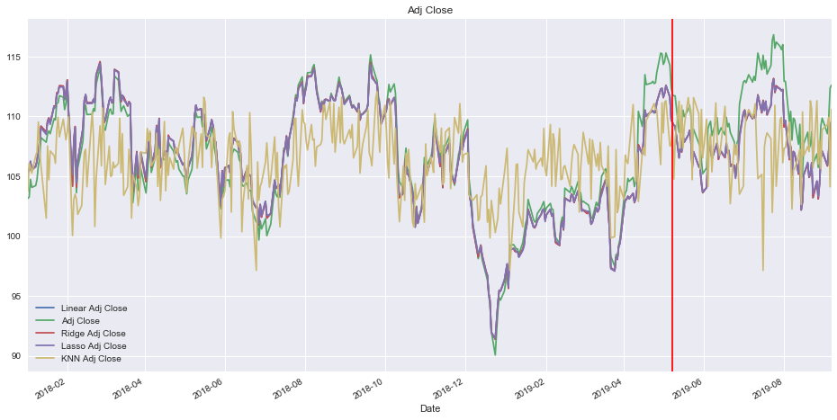
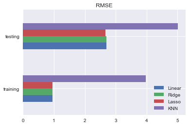

# Stock price prediction using Scikit Learn

In this project, I use [Scikit Learn](https://scikit-learn.org/stable/) packages to train some regression models listed below and predict the stock price.

* Linear regression
* Ridge regression
* Lasso regression
* KNN regression

I choose [JPMorgan Chase & Co](https://finance.yahoo.com/quote/JPM/history?p=JPM&.tsrc=fin-srch) and download its stock prices from 2018-01-01 to 2019-09-06.

## Data exploration

First, I briefly explore the data by examining moving average and return deviation.

* Moving average of JPM:

* Return deviation:

## Train the regression models

The vertical red line indicates the split time point between training and testing set, which is 80%/20% in the code setting.

### Linear regression

### Ridge regression

### Lasso regression

### KNN regression

## All models comparision

From the comparision, the Lasso regression model performs best among other 3 regression models.

### Predictions

### RMSE

All details can be found in the Stock_prediction.ipynb file, please check it out.

I will add some reinforcement learning models later on.
