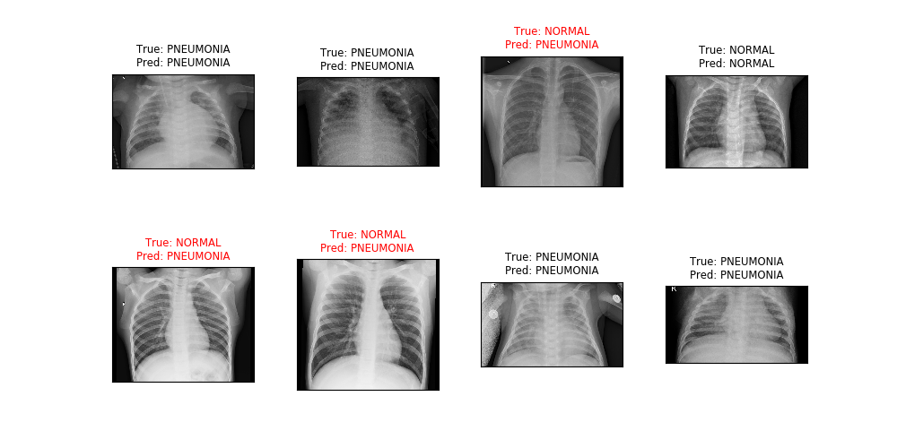

# Medical images classifier using TensorFlow and Keras

In this project, I use TensorFlow and Keras to fine tune InceptionV3 model based on [the code here](https://github.com/anjanatiha/Pneumonia-Detection-from-Chest-X-Ray-Images-with-Deep-Learning/blob/master/code/Detection%20of%20Pneumonia%20from%20Chest%20X-Ray%20Images%201.0.0.3.ipynb).

The dataset I use is [Chest X-Ray Images (Pneumonia)](https://www.kaggle.com/paultimothymooney/chest-xray-pneumonia) in Kaggle competition.

## Confusion matrix

## Testing results

The details are in the notebook.
