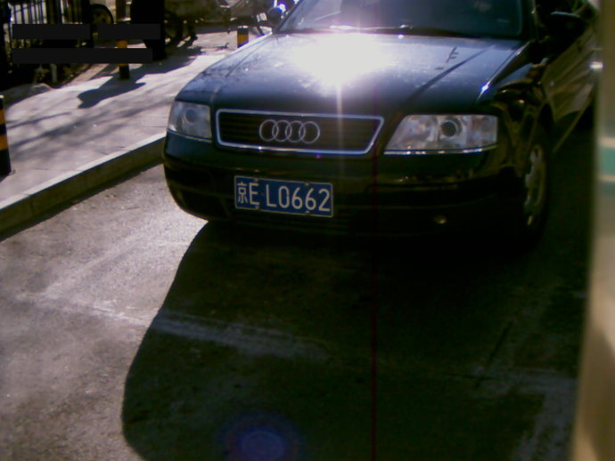
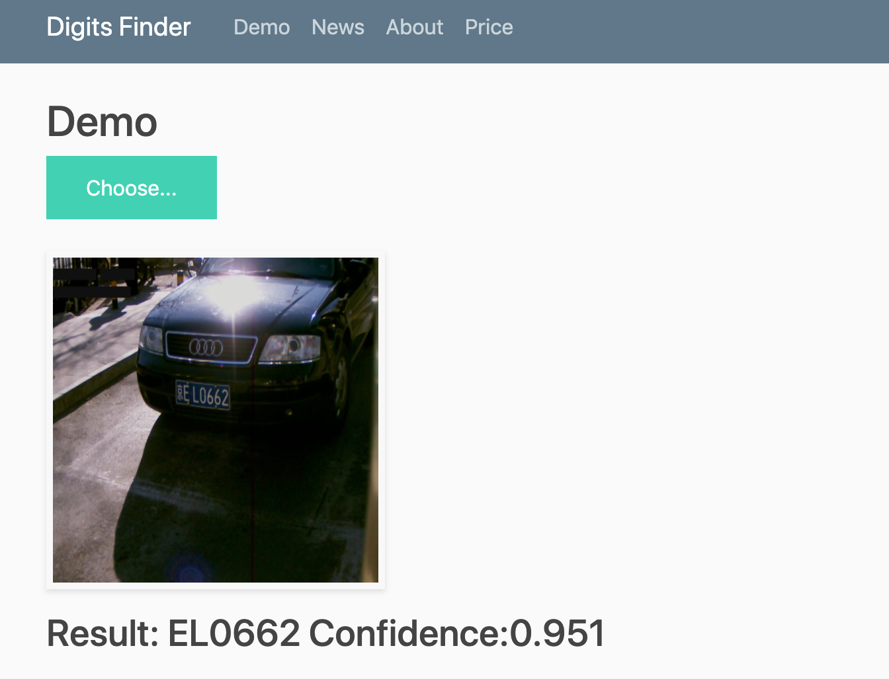
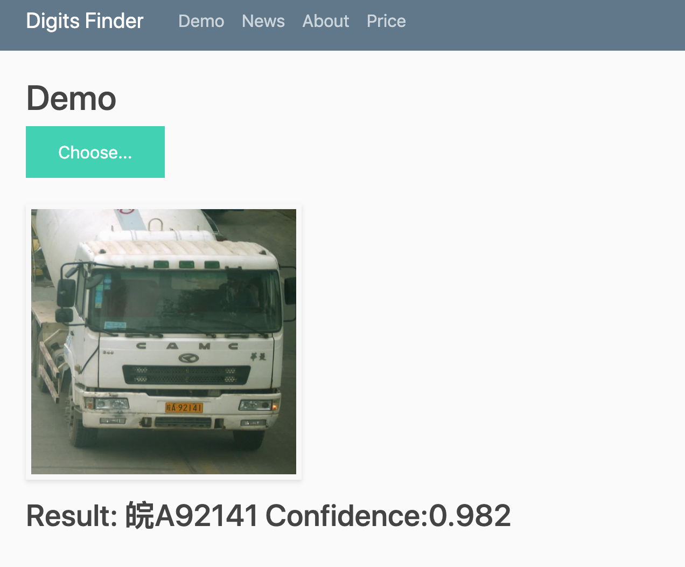

# Digits Finder

In this project, I use a pretrained model based on [HyperLPR](https://github.com/zeusees/HyperLPR), which is a license plate recognition model suited in China.

Combining this model and some web application functions including User Login, Payment, and Demo, I create a prototype web service called [Digits Finder](https://digitsfinder.herokuapp.com/index) which aims to recoginize numbers and characters in images or videos very fast and accurate in the future developements.

## Demo

### Image #1

* License Plate: 京 EL0662

* Demo result: EL0662

### Image #2

* License Plate: 皖 A92141

* Demo result: 皖 A92141

## Potential Applications

### Parking lot fee charging system

### Some numbers OCR application such as checking the invoice numbers in Taiwan
