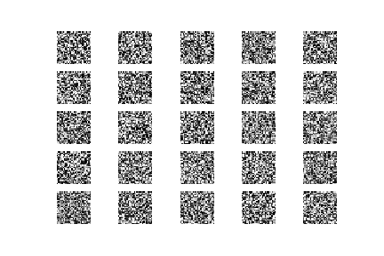
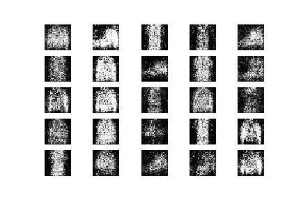
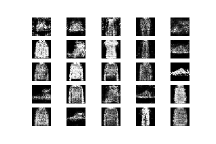

# Fashion designs generator using TensorFlow and Keras

In this project, I use TensorFlow and Keras to train a GAN model based on [the code here](https://github.com/R-Suresh/GAN_fashion_MNIST).

The dataset used here is well-known [Fashion-MNIST](https://github.com/zalandoresearch/fashion-mnist).

## Results of the GAN model

### Initial model result (0 epochs)

### Training results as epochs increasing (500 epochs to 5000 epochs)
 

All training details can be found in the jupyter notebook.
