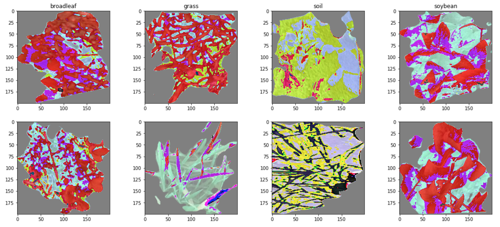
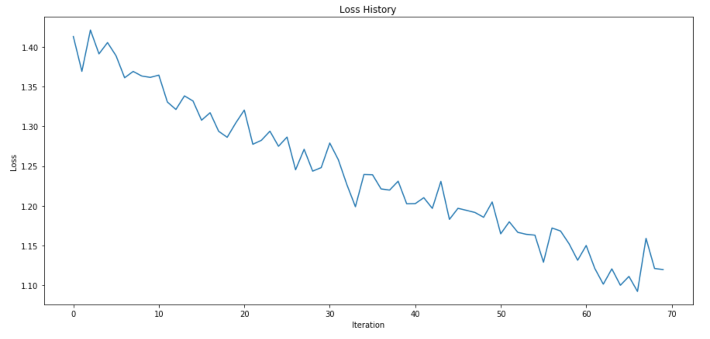
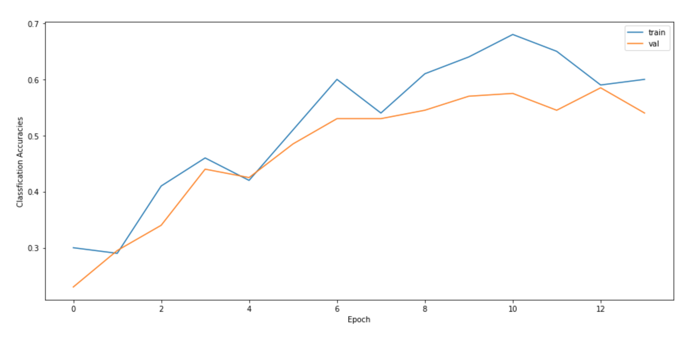
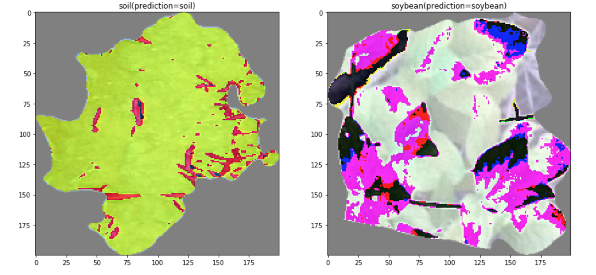

# Weed Detection in Soybean Crops using Numpy

In this project, I use Numpy to train a NN model baesd on [the code here](https://www.kaggle.com/datduyn/2-layer-net-on-weeds-discriminant/).

The dataset I use is [Weed Detection in Soybean Crops](https://www.kaggle.com/fpeccia/weed-detection-in-soybean-crops) in Kaggle competition.

## Dataset simple overview

There are 4 classes in this dataset including broadleaf, grass, soil, and soybean.

## Training Results of the NN model

### Training loss vs epochs

### Training and evaluation accuracy vs epochs

## Predictions

All training details can be found in the jupyter notebook.
